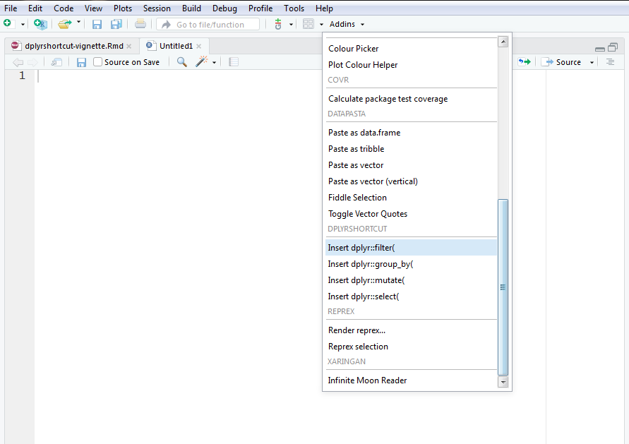
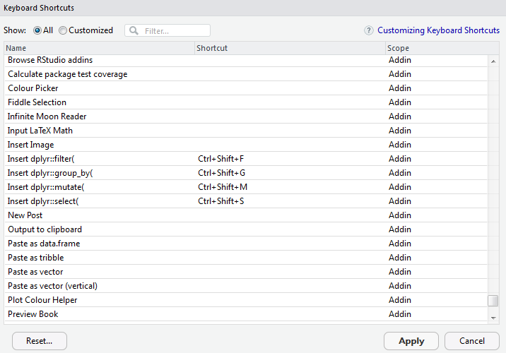

dplyrshortcut R package
=======

People are saying that if you are repeating a code more than twice, then creates a function for it. The idea of `dplyrshortcut` is that if you are using a function more than twice, then use a keyboard shortcut.

## Installation

You can install the development version of `dplyrshortcut` with the [devtools](https://http://devtools.r-lib.org) package.

``` r
# install.packages("devtools")
devtools::install_github("damien-dupre/dplyrshortcut")
```

## Use

`dplyrshortcut` add functions in RStudio IDE's Addins section.



Then, in order to add the shortcut to your keyboard, use the Rstudio IDE: Tools>Modify Keyboard Shortcuts... and associate the keyboard shortcut you prefer, such as:

* Ctrl+Shift+F for "dplyr::filter("
* Ctrl+Shift+M for "dplyr::mutate("
* Ctrl+Shift+G for "dplyr::group_by("
* Ctrl+Shift+S for "dplyr::select("

and modify Insert Pipe Operator with Ctrl+Shift+P.


